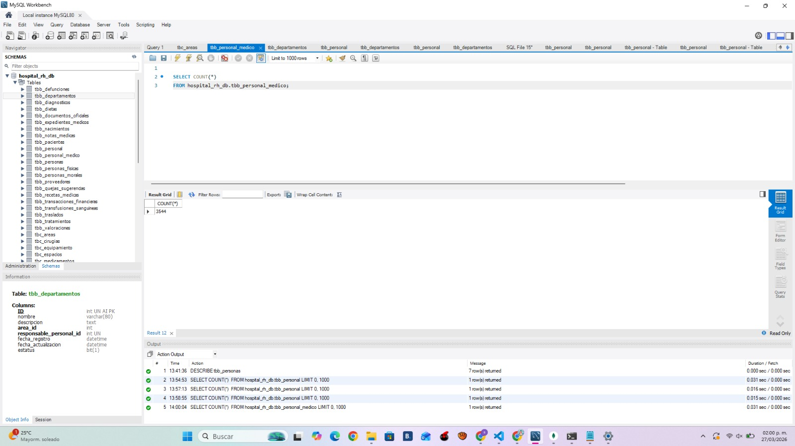
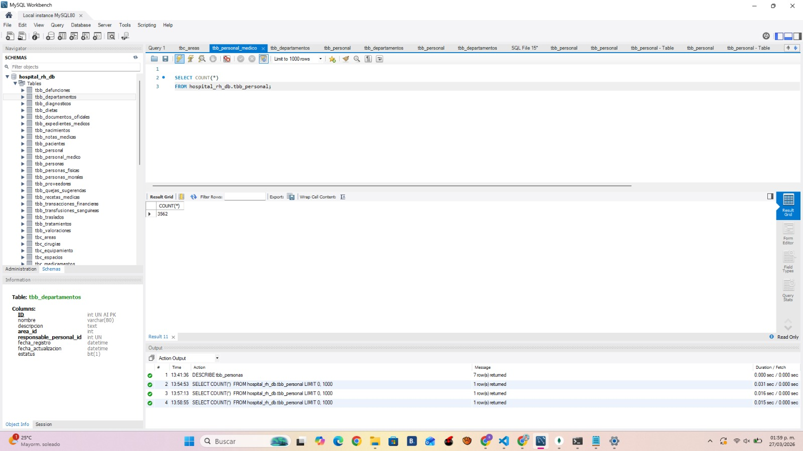

# 📋 API de Gestión Hospitalaria — RH

API REST para la gestión de **personal**, **médicos**, **pacientes** e **incapacidades** en un entorno hospitalario. Construida con **Node.js / Express**, conectada a **MySQL** (datos relacionales) y **MongoDB** (datos NoSQL).

---

## 🚀 Requisitos previos

- Node.js (v18 o superior recomendado)
- MySQL activo (local o remoto)
- MongoDB activo (local o remoto)
- npm o yarn

---

## ⚙️ Instalación y ejecución

```bash
# Instalar dependencias
npm install

# Configurar variables de entorno
# Crear un archivo .env con las siguientes variables:
# MONGO_URI=mongodb://127.0.0.1:27017/hospital_mongo
# PORT=3000

# Iniciar el servidor
node app.js
```

---

## 🗄️ Configuración de la base de datos

### Conexión MySQL — `db/connection.js`

```javascript
const mysql = require("mysql2/promise");

const pool = mysql.createPool({
  host: process.env.MYSQL_HOST,
  user: process.env.MYSQL_USER,
  password: process.env.MYSQL_PASSWORD,
  database: process.env.MYSQL_DATABASE,
  port: process.env.MYSQL_PORT,
  waitForConnections: true,
  connectionLimit: 10
});

module.exports = pool;
```

### Conexión MongoDB — `db/mongodb.js`

```javascript
const mongoose = require('mongoose');

const connectMongo = async () => {
  try {
    await mongoose.connect(process.env.MONGO_URI);
    console.log('MongoDB conectado');
  } catch (error) {
    console.error('Error Mongo:', error);
  }
};

module.exports = connectMongo;
```

### Variables de entorno — `.env`

```env
MYSQL_HOST=
MYSQL_USER=
MYSQL_PASSWORD=
MYSQL_DATABASE=
MYSQL_PORT=
MONGO_URI=
PORT=
```


---

## 📌 Endpoints

### 👥 Personal

| Método | Endpoint        | Descripción              |
|--------|-----------------|--------------------------|
| POST   | `/api/personal` | Crear nuevo personal     |
| GET    | `/api/personal` | Obtener todo el personal |

### 🏥 Incapacidades

| Método | Endpoint             | Descripción                     |
|--------|----------------------|---------------------------------|
| POST   | `/api/incapacidades` | Registrar nueva incapacidad     |
| GET    | `/api/incapacidades` | Obtener todas las incapacidades |

---

## 📬 Ejemplos de Request y Response

---

### `POST /api/personal` — Crear Personal

Registra un nuevo empleado en el sistema. Se ingresan los datos del personal en formato JSON y el servidor responde con un mensaje de confirmación y el `id` generado.

**Request**
```http
POST http://localhost:3000/api/personal
Content-Type: application/json
```

```json
{
  "persona_id": 1000,
  "departamento_id": 1,
  "numero_empleado": "EMP900",
  "puesto": "Enfermero",
  "tipo_contrato": "Base",
  "fecha_ingreso": "2024-01-01",
  "salario": 9000
}
```

**Response `200 OK`**
```json
{
  "message": "Personal creado",
  "id": 26
}
```

<p align="center">
  
</p>

---

### `GET /api/personal` — Obtener Todo el Personal

Lista todos los empleados registrados en la base de datos. No requiere parámetros. Retorna un arreglo con los datos completos de cada empleado.

**Request**
```http
GET http://localhost:3000/api/personal
Accept: */*
```

**Response `200 OK`**
```json
[
  {
    "ID": 14,
    "persona_id": 2,
    "departamento_id": 3,
    "numero_empleado": "EMP002",
    "puesto": "Analista RH",
    "tipo_contrato": "BASE",
    "fecha_ingreso": "2019-03-10T06:00:00.000Z",
    "fecha_baja": null,
    "salario": "18000.00",
    "fecha_registro": "2026-02-20T04:27:05.000Z",
    "fecha_actualizacion": null
  }
]
```

<p align="center">
  
</p>

---

### 📊 Total de Registros — Personal y Médico

Conteo de registros en las tablas de personal y médicos dentro de la base de datos.

<p align="center">
  
</p>

<p align="center">
  
</p>

---

### `POST /api/incapacidades` — Registrar Incapacidad

Crea una nueva incapacidad asociada a un empleado. Requiere `personal_id`, `tipo`, `descripcion`, `fecha_inicio` y `fecha_fin`. El servidor responde con código `201` y el documento creado en MongoDB.

**Request**
```http
POST http://localhost:3000/api/incapacidades
Content-Type: application/json
```

```json
{
  "personal_id": 1,
  "tipo": "Enfermedad",
  "descripcion": "Gripe fuerte",
  "fecha_inicio": "2026-03-01",
  "fecha_fin": "2026-03-05"
}
```

**Response `201 Created`**
```json
{
  "message": "Incapacidad creada correctamente",
  "data": {
    "personal_id": 1,
    "tipo": "Enfermedad",
    "descripcion": "Gripe fuerte",
    "fecha_inicio": "2026-03-01T00:00:00.000Z",
    "fecha_fin": "2026-03-05T00:00:00.000Z",
    "_id": "69c659a7b22fb247170c7ef7",
    "__v": 0
  }
}
```

<p align="center">
  
</p>

---

### `GET /api/incapacidades` — Obtener Todas las Incapacidades

Lista todas las incapacidades registradas. No requiere parámetros. Retorna un arreglo con todos los documentos de la colección `incapacidades` en MongoDB.

**Request**
```http
GET http://localhost:3000/api/incapacidades
Accept: application/json
```

**Response `200 OK`**
```json
[
  {
    "_id": "69c6540bb22fb247170c7ef1",
    "personal_id": 13,
    "tipo": "Enfermedad",
    "descripcion": "Gripe fuerte",
    "fecha_inicio": "2026-03-01T00:00:00.000Z",
    "fecha_fin": "2026-03-05T00:00:00.000Z",
    "__v": 0
  },
  {
    "_id": "69c6540bb22fb247170c7ef4",
    "personal_id": 6,
    "tipo": "Accidente",
    "descripcion": "Automovilistico",
    "fecha_inicio": "2026-03-01T00:00:00.000Z",
    "fecha_fin": "2026-03-05T00:00:00.000Z",
    "__v": 0
  }
]
```

<p align="center">
  
</p>

---

### 🗄️ Resultado en MongoDB Compass

Los documentos se almacenan en la colección `incapacidades` dentro de la base de datos `hospital_mongo`. Desde MongoDB Compass se puede visualizar cada registro con su `_id` generado automáticamente, el `personal_id` asociado, el tipo, descripción y fechas.

<p align="center">
  
</p>

<p align="center">
  
</p>

---

## ⚠️ Errores y Validaciones

---

### `400` — Tipo de incapacidad vacío

Si el campo `tipo` se envía vacío o no se incluye, el servidor rechaza la petición con un mensaje descriptivo.

**Request**
```json
{
  "personal_id": 27,
  "tipo": "",
  "descripcion": "Cuarentena",
  "fecha_inicio": "2026-03-01",
  "fecha_fin": "2027-03-05"
}
```

**Response `400 Bad Request`**
```json
{
  "message": "Falta el tipo de incapacidad"
}
```

<p align="center">
  
</p>

---

### `400` — Fecha de fin anterior a fecha de inicio

Si `fecha_fin` es anterior a `fecha_inicio`, la API valida y rechaza la petición con un mensaje de error claro.

**Request**
```json
{
  "personal_id": 3,
  "tipo": "Enfermedad",
  "descripcion": "Error de fechas",
  "fecha_inicio": "2026-03-10",
  "fecha_fin": "2026-03-05"
}
```

**Response `400 Bad Request`**
```json
{
  "message": "La fecha de fin no puede ser anterior a la de inicio"
}
```

<p align="center">
  
</p>

---

## 📦 Script para la Prueba Masiva

Para validar el comportamiento del sistema bajo condiciones de volumen real, se desarrolló el script `scripts/volumeTest.js`. Este genera e inserta de forma automática miles de registros en las tablas de MySQL y en la colección de MongoDB, respetando en todo momento las dependencias entre tablas (claves foráneas) y las reglas de negocio del sistema. Las inserciones se realizan por lotes de 1,000 registros para evitar saturar las conexiones a base de datos.

Antes de ejecutarlo, instala la dependencia necesaria:

```bash
npm install @faker-js/faker
```

Para correrlo:

```bash
# Insertar 1,000 registros (valor por defecto)
node scripts/volumeTest.js

# Insertar una cantidad personalizada
node scripts/volumeTest.js 5000
```

### `scripts/volumeTest.js`

```javascript
const pool = require('../db/connection');
const connectMongo = require('../db/mongodb');
const Incapacidad = require('../models/incapacidad.model');

let faker;

const loadFaker = async () => {
    const fakerModule = await import('@faker-js/faker');
    faker = fakerModule.faker;
};

const BATCH_SIZE = 1000;

const DEPARTAMENTOS_VALIDOS = [1, 2, 3, 4];
const AREAS_VALIDAS = [1, 5, 6, 7];

// ===============================
// GENERADORES
// ===============================

const generarPersona = () => {
    let pais = faker.location.country();
    if (pais.length > 50) {
        pais = pais.substring(0, 50);
    }
    return {
        tipo: faker.helpers.arrayElement(['Fisica', 'Moral']),
        rfc: faker.string.alphanumeric(13).toUpperCase(),
        pais_origen: pais,
        fecha_registro: new Date(),
        fecha_actualizacion: new Date(),
        estatus: 1
    };
};

const generarPersonal = (persona_id) => ({
    persona_id,
    departamento_id: faker.helpers.arrayElement(DEPARTAMENTOS_VALIDOS),
    numero_empleado: faker.string.numeric(6),
    puesto: faker.person.jobTitle(),
    tipo_contrato: faker.helpers.arrayElement(['BASE', 'EVENTUAL', 'HONORARIOS']),
    fecha_ingreso: faker.date.past(),
    fecha_baja: null,
    salario: faker.number.float({ min: 5000, max: 50000 }),
    fecha_registro: new Date(),
    fecha_actualizacion: new Date(),
    estatus: 1
});

const generarMedico = (personal_id) => ({
    personal_id,
    cedula_profesional: faker.string.numeric(8),
    especialidad: faker.person.jobType(),
    turno: faker.helpers.arrayElement(['Matutino', 'Vespertino', 'Nocturno']),
    area_id: faker.helpers.arrayElement(AREAS_VALIDAS),
    fecha_registro: new Date(),
    fecha_actualizacion: new Date(),
    estatus: 1
});

const generarIncapacidad = (personal_id) => {
    const inicio = faker.date.recent();
    const fin = new Date(inicio);
    fin.setDate(fin.getDate() + faker.number.int({ min: 1, max: 10 }));

    return {
        personal_id,
        tipo: faker.helpers.arrayElement(['Enfermedad', 'Accidente', 'Maternidad', 'Otro']),
        descripcion: faker.lorem.sentence(),
        fecha_inicio: inicio,
        fecha_fin: fin
    };
};

// ===============================
// PERSONAS (SQL)
// ===============================

const insertarPersonasBatch = async (cantidad) => {
    let ids = [];

    const [[{ maxId }]] = await pool.query(`SELECT IFNULL(MAX(ID),0) as maxId FROM tbb_personas`);
    let startId = maxId + 1;

    for (let i = 0; i < cantidad; i += BATCH_SIZE) {
        const batch = [];

        for (let j = 0; j < BATCH_SIZE && i + j < cantidad; j++) {
            batch.push(generarPersona());
        }

        const values = batch.map((p, index) => [
            startId + index,
            p.tipo,
            p.rfc,
            p.pais_origen,
            p.fecha_registro,
            p.fecha_actualizacion,
            p.estatus
        ]);

        await pool.query(`
            INSERT INTO tbb_personas
            (ID, tipo, rfc, pais_origen, fecha_registro, fecha_actualizacion, estatus)
            VALUES ?
        `, [values]);

        for (let k = 0; k < values.length; k++) {
            ids.push(startId + k);
        }

        startId += values.length;

        console.log(`👤 Personas: ${ids.length}`);
    }

    return ids;
};

// ===============================
// PERSONAL (SQL)
// ===============================

const insertarPersonalBatch = async (personaIds) => {
    let ids = [];

    for (let i = 0; i < personaIds.length; i += BATCH_SIZE) {
        const batch = personaIds.slice(i, i + BATCH_SIZE);

        const values = batch.map(pid => {
            const p = generarPersonal(pid);
            return [
                p.persona_id,
                p.departamento_id,
                p.numero_empleado,
                p.puesto,
                p.tipo_contrato,
                p.fecha_ingreso,
                p.fecha_baja,
                p.salario,
                p.fecha_registro,
                p.fecha_actualizacion,
                p.estatus
            ];
        });

        const [result] = await pool.query(`
            INSERT INTO tbb_personal
            (persona_id, departamento_id, numero_empleado, puesto, tipo_contrato,
             fecha_ingreso, fecha_baja, salario, fecha_registro, fecha_actualizacion, estatus)
            VALUES ?
        `, [values]);

        let startId = result.insertId;

        for (let k = 0; k < values.length; k++) {
            ids.push(startId + k);
        }

        console.log(`Personal: ${ids.length}`);
    }

    return ids;
};

// ===============================
// MEDICOS (SQL)
// ===============================

const insertarMedicosBatch = async (ids) => {
    for (let i = 0; i < ids.length; i += BATCH_SIZE) {
        const batch = ids.slice(i, i + BATCH_SIZE);

        const values = batch.map(id => {
            const m = generarMedico(id);
            return [
                m.personal_id,
                m.cedula_profesional,
                m.especialidad,
                m.turno,
                m.area_id,
                m.fecha_registro,
                m.fecha_actualizacion,
                m.estatus
            ];
        });

        await pool.query(`
            INSERT INTO tbb_personal_medico
            (personal_id, cedula_profesional, especialidad, turno, area_id,
             fecha_registro, fecha_actualizacion, estatus)
            VALUES ?
        `, [values]);

        console.log(`🩺 Médicos: ${i + batch.length}`);
    }
};

// ===============================
// INCAPACIDADES (Mongo)
// ===============================

const insertarIncapacidadesBatch = async (ids) => {
    for (let i = 0; i < ids.length; i += BATCH_SIZE) {
        const batch = ids.slice(i, i + BATCH_SIZE);

        const docs = batch.map(id => generarIncapacidad(id));

        await Incapacidad.insertMany(docs);

        console.log(` Incapacidades: ${i + batch.length}`);
    }
};

// ===============================
// MAIN
// ===============================

const run = async () => {
    await loadFaker();

    const cantidad = parseInt(process.argv[2]) || 1000;

    console.log(` Generando ${cantidad} registros nuevos`);

    await connectMongo();

    console.time(" Tiempo total");

    const personaIds = await insertarPersonasBatch(cantidad);
    const personalIds = await insertarPersonalBatch(personaIds);

    await insertarMedicosBatch(personalIds);
    await insertarIncapacidadesBatch(personalIds);

    console.timeEnd("Tiempo total");

    console.log(" Finalizado");
    process.exit();
};

run();
```

---

## 📐 Diagrama y Diccionario de Datos

El sistema utiliza una arquitectura híbrida donde **MySQL** gestiona la información estructurada del personal y **MongoDB** almacena las incapacidades. Las relaciones entre ambas bases se manejan mediante referencias lógicas usando el campo `personal_id` como puente entre los dos motores.

---

### Tabla: `tbb_personal` — MySQL

| Campo | Tipo | Descripción |
|-------|------|-------------|
| `id` | INT | Identificador del personal |
| `persona_id` | INT | Relación con persona física |
| `departamento_id` | INT | Departamento asignado |
| `numero_empleado` | VARCHAR | Número único de empleado |
| `puesto` | VARCHAR | Puesto laboral |
| `tipo_contrato` | VARCHAR | Tipo de contrato |
| `fecha_ingreso` | DATE | Fecha de ingreso |
| `salario` | DECIMAL | Salario del empleado |

---

### Tabla: `tbb_personal_medico` — MySQL

| Campo | Tipo | Descripción |
|-------|------|-------------|
| `id` | INT | Identificador |
| `personal_id` | INT | Relación con personal |
| `cedula_profesional` | VARCHAR | Cédula profesional |
| `especialidad` | VARCHAR | Especialidad médica |
| `turno` | VARCHAR | Turno asignado |
| `area_id` | INT | Área médica |

---

### Colección: `incapacidades` — MongoDB

| Campo | Tipo | Descripción |
|-------|------|-------------|
| `_id` | ObjectId | Identificador único generado por MongoDB |
| `personal_id` | Number | Referencia al personal en MySQL |
| `tipo` | String | Tipo de incapacidad |
| `descripcion` | String | Descripción del motivo |
| `fecha_inicio` | Date | Fecha de inicio de la incapacidad |
| `fecha_fin` | Date | Fecha de fin de la incapacidad |

---

## 🛠️ Tecnologías utilizadas

- **Node.js** + **Express** — Servidor y routing
- **MySQL** (`mysql2/promise`) — Base de datos relacional
- **MongoDB** — Base de datos NoSQL
- **Mongoose** — ODM para MongoDB
- **@faker-js/faker** — Generación de datos para simulación masiva
- **Swagger UI** — Documentación interactiva (`/api-docs`)
- **MongoDB Compass** — Visualización de datos en BD

---

## 🗄️ Base de datos

### MySQL
- **Base de datos:** `hospital_rh_db`
- **Puerto:** `3307`
- **Tablas principales:** `tbb_personas`, `tbb_personal`, `tbb_personal_medico`

### MongoDB
- **Base de datos:** `hospital_mongo`
- **Puerto:** `27017`
- **Colecciones principales:**
  - `incapacidades` — Registros de incapacidades médicas

---

## 🗂️ Estructura del proyecto

```
API-HR/
├── controllers/
│   ├── incapacidad.controller.js
│   ├── medico.controller.js
│   ├── pacientes.controller.js
│   └── personal.controller.js
├── db/
│   ├── connection.js       # Conexión MySQL
│   └── mongodb.js          # Conexión MongoDB
├── models/
│   └── incapacidad.model.js
├── routes/
│   ├── incapacidad.routes.js
│   ├── medico.routes.js
│   ├── pacientes.routes.js
│   └── personal.routes.js
├── scripts/
│   └── volumeTest.js       # Script de simulación masiva
├── img/
├── .env
├── app.js
├── package.json
└── swagger.js
