<div align="center">

# 🏥 Hospital MR — Pruebas de API
### Evidencias de validación sobre los endpoints de `hospital_api.py`


</div>
Cracion de la rama Brisa_dev


---

## 📋 Índice de Pruebas

| # | Descripción | Pacientes | Estado |
|---|-------------|-----------|--------|
| [1](#-prueba-1---registrar-100k-pacientes) | Registrar 100k Pacientes | 100,000 | ✅ |
| [2](#-prueba-2---registrar-5k-pacientes-femeninas-de-20-a-50-años) | Registrar 5k Pacientes Femeninas (20–50 años) | 5,000 | ✅ |
| [3](#-prueba-3---registrar-330-pacientes-masculinos-con-discapacidad) | Registrar 330 Pacientes Masculinos con Discapacidad | 330 | ✅ |
| [4](#-prueba-4---registrar-1500-pacientes-neonatos) | Registrar 1500 Pacientes Neonatos | 1,500 | ✅ |
| [5](#-prueba-5---registrar-325-pacientes-fallecidos-recién-nacidos) | Registrar 325 Pacientes Fallecidos Recién Nacidos | 325 | ✅ |
| [6](#-prueba-6---registrar-832-pacientes-diabéticos-de-5-a-22-años) | Registrar 832 Pacientes Diabéticos (5–22 años) | 832 | ✅ |
| [7](#-prueba-7---registrar-625-pacientes-masculinos-pediátricos) | Registrar 625 Pacientes Masculinos Pediátricos | 625 | ✅ |
| [8](#-prueba-8---registrar-111-pacientes-en-coma) | Registrar 111 Pacientes en Coma | 111 | ✅ |
| [9](#-prueba-9---registrar-23k-pacientes-no-binarios) | Registrar 23k Pacientes No Binarios | 23,000 | ✅ |
| [10](#-prueba-10---registrar-3416-pacientes-con-covid-vivos-y-fallecidos) | Registrar 3416 Pacientes con COVID | 3,416 | ✅ |

---

## 🧪 Prueba 1 - Registrar 100k Pacientes

**Descripción:**
Se envía una solicitud para registrar 100,000 pacientes sin ningún filtro adicional, probando la capacidad máxima del procedimiento almacenado para inserción masiva de datos.

> **Endpoint:** `POST /api/poblar-pacientes`

```json
{
  "cantidad": 100000
}
```

**Evidencia de la solicitud:**

<p align="center">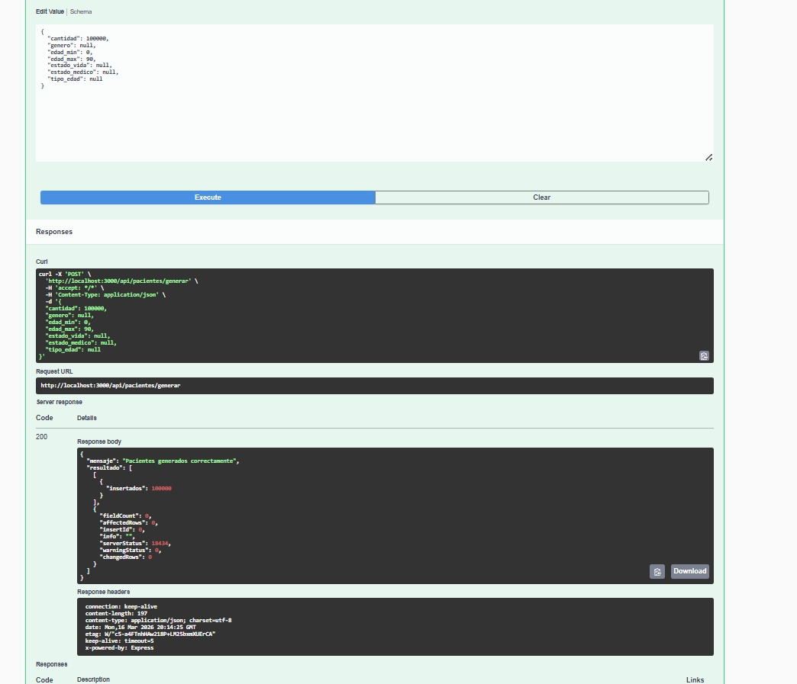</p>

**Respuesta retornada por la API:**
```json
{
  "success": true,
  "message": "Procedimiento ejecutado exitosamente. 100000 paciente(s) procesado(s)",
  "parametros": {
    "cantidad": 100000,
    "genero": null,
    "edad_minima": null,
    "edad_maxima": null,
    "estatus_vida": null,
    "estatus_medico": null,
    "etapa_vida": null
  },
  "resultado": []
}
```

**Resultados:**
Se registraron exitosamente 100,000 pacientes sin filtros, confirmando que el procedimiento almacenado maneja correctamente inserciones masivas a gran escala.

<p align="center">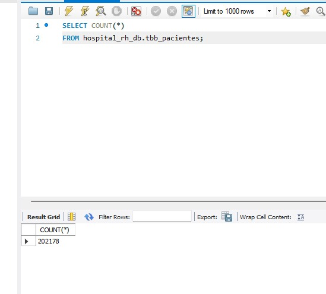</p>

---

## 🧪 Prueba 2 - Registrar 5k Pacientes Femeninas de 20 a 50 años

**Descripción:**
Se valida el correcto funcionamiento del filtro por género (`"M"`) combinado con un rango de edad específico, registrando 5,000 pacientes femeninas de entre 20 y 50 años.

> **Endpoint:** `POST /api/poblar-pacientes`

```json
{
  "cantidad": 5000,
  "genero": "M",
  "edad_minima": 20,
  "edad_maxima": 50
}
```

**Evidencia de la solicitud:**

<p align="center">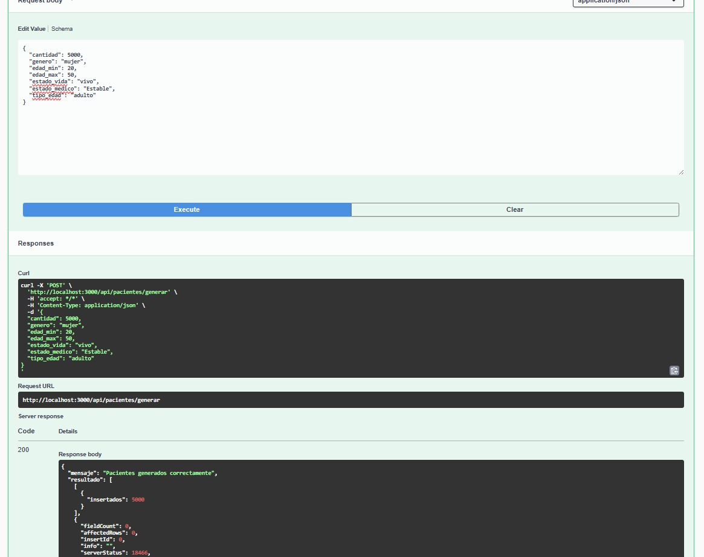</p>

**Respuesta retornada por la API:**
```json
{
  "success": true,
  "message": "Procedimiento ejecutado exitosamente. 5000 paciente(s) procesado(s)",
  "parametros": {
    "cantidad": 5000,
    "genero": "M",
    "edad_minima": 20,
    "edad_maxima": 50,
    "estatus_vida": null,
    "estatus_medico": null,
    "etapa_vida": null
  },
  "resultado": []
}
```

**Resultados:**
Se registraron exitosamente 5,000 pacientes femeninas en el rango de edad de 20 a 50 años, confirmando el correcto funcionamiento del filtro por género y rango de edad.

<p align="center">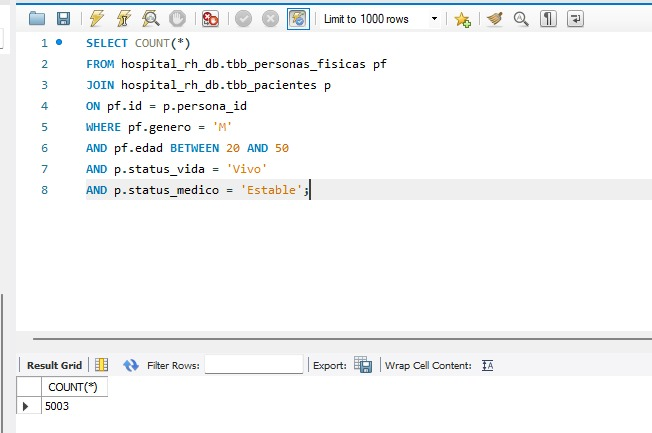</p>

---

## 🧪 Prueba 3 - Registrar 330 Pacientes Masculinos con Discapacidad

**Descripción:**
Se verifica que el filtro combinado de género (`"H"`) y estatus de vida (`"Invalido"`) funcione correctamente al registrar 330 pacientes masculinos con discapacidad.

> **Endpoint:** `POST /api/poblar-pacientes`

```json
{
  "cantidad": 330,
  "genero": "H",
  "etapa_vida": null,
  "estatus_vida": "Invalido"
}
```

**Evidencia de la solicitud:**

<p align="center">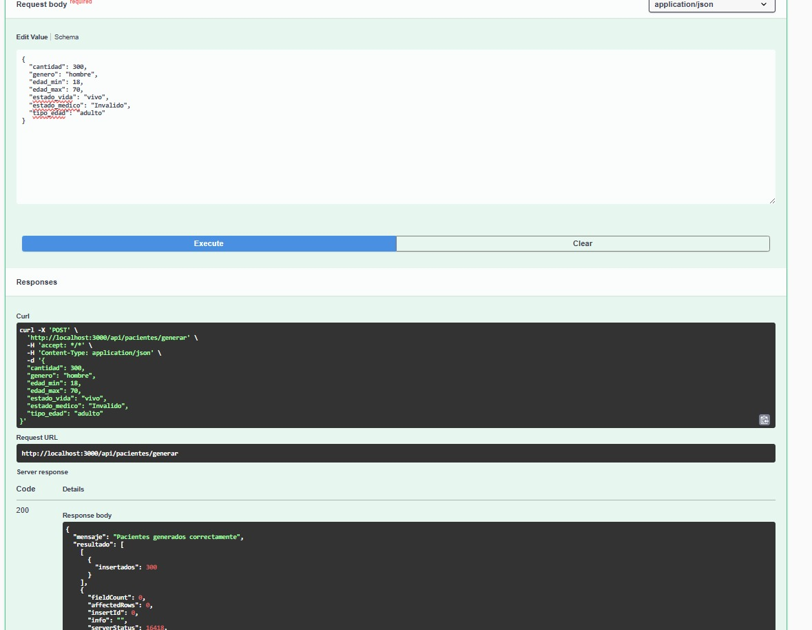</p>

**Respuesta retornada por la API:**
```json
{
  "success": true,
  "message": "Procedimiento ejecutado exitosamente. 330 paciente(s) procesado(s)",
  "parametros": {
    "cantidad": 330,
    "genero": "H",
    "edad_minima": null,
    "edad_maxima": null,
    "estatus_vida": "Invalido",
    "estatus_medico": null,
    "etapa_vida": null
  },
  "resultado": []
}
```

**Resultados:**
Se registraron exitosamente 330 pacientes masculinos con estatus de vida `Inválido`, verificando que el filtro combinado de género y estatus de vida opera correctamente.

<p align="center"></p>

---

## 🧪 Prueba 4 - Registrar 1500 Pacientes Neonatos

**Descripción:**
Se valida que el parámetro `etapa_vida` sea procesado correctamente al registrar 1,500 pacientes en etapa neonatal, sin restricciones adicionales de género o edad.

> **Endpoint:** `POST /api/poblar-pacientes`

```json
{
  "cantidad": 1500,
  "etapa_vida": "Neonato"
}
```

**Evidencia de la solicitud:**

<p align="center">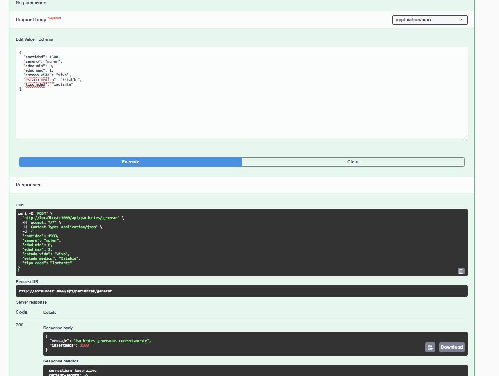</p>

**Respuesta retornada por la API:**
```json
{
  "success": true,
  "message": "Procedimiento ejecutado exitosamente. 1500 paciente(s) procesado(s)",
  "parametros": {
    "cantidad": 1500,
    "genero": null,
    "edad_minima": null,
    "edad_maxima": null,
    "estatus_vida": null,
    "estatus_medico": null,
    "etapa_vida": "Neonato"
  },
  "resultado": []
}
```

**Resultados:**
Se registraron exitosamente 1,500 pacientes en etapa neonatal, validando que el parámetro `etapa_vida` es procesado de forma correcta por el procedimiento almacenado.

<p align="center">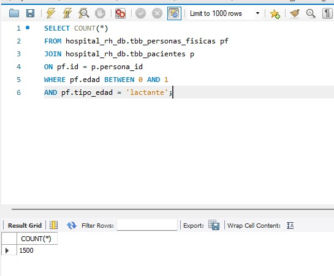</p>

---

## 🧪 Prueba 5 - Registrar 325 Pacientes Fallecidos Recién Nacidos

**Descripción:**
Se comprueba que la combinación de `estatus_vida: "Finado"` y `etapa_vida: "Recién nacido"` no genere conflictos en el procedimiento almacenado, registrando 325 pacientes fallecidos recién nacidos.

> **Endpoint:** `POST /api/poblar-pacientes`

```json
{
  "cantidad": 325,
  "estatus_vida": "Finado",
  "etapa_vida": "Recién nacido"
}
```

**Evidencia de la solicitud:**

<p align="center">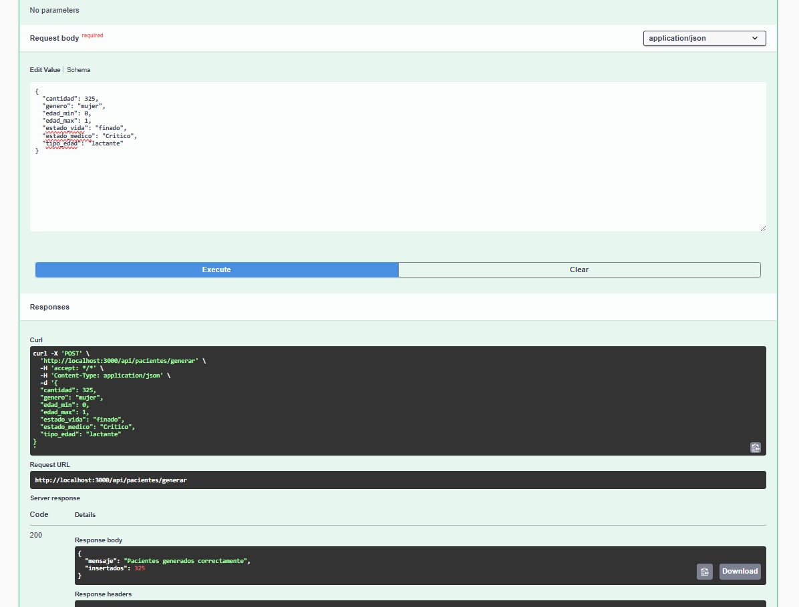</p>

**Respuesta retornada por la API:**
```json
{
  "success": true,
  "message": "Procedimiento ejecutado exitosamente. 325 paciente(s) procesado(s)",
  "parametros": {
    "cantidad": 325,
    "genero": null,
    "edad_minima": null,
    "edad_maxima": null,
    "estatus_vida": "Finado",
    "estatus_medico": null,
    "etapa_vida": "Recién nacido"
  },
  "resultado": []
}
```

**Resultados:**
Se registraron exitosamente 325 pacientes fallecidos en etapa de recién nacido, confirmando que la combinación de `estatus_vida` y `etapa_vida` funciona sin conflictos.

<p align="center"></p>

---

## 🧪 Prueba 6 - Registrar 832 Pacientes Diabéticos de 5 a 22 años

**Descripción:**
Se verifica que el filtro `estatus_medico: "Diabetico"` en conjunto con un rango de edad de 5 a 22 años registre correctamente los 832 pacientes indicados.

> **Endpoint:** `POST /api/poblar-pacientes`

```json
{
  "cantidad": 832,
  "edad_minima": 5,
  "edad_maxima": 22,
  "estatus_medico": "Diabetico"
}
```

**Evidencia de la solicitud:**

<p align="center">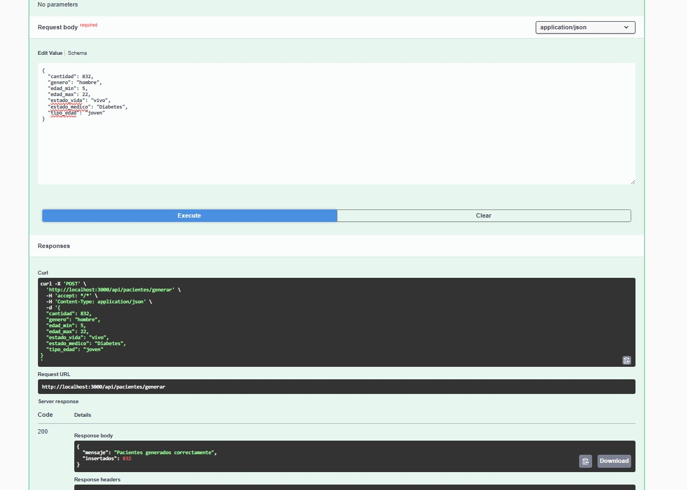</p>

**Respuesta retornada por la API:**
```json
{
  "success": true,
  "message": "Procedimiento ejecutado exitosamente. 832 paciente(s) procesado(s)",
  "parametros": {
    "cantidad": 832,
    "genero": null,
    "edad_minima": 5,
    "edad_maxima": 22,
    "estatus_vida": null,
    "estatus_medico": "Diabetico",
    "etapa_vida": null
  },
  "resultado": []
}
```

**Resultados:**
Se registraron exitosamente 832 pacientes diabéticos con edades comprendidas entre 5 y 22 años, verificando que el filtro de `estatus_medico` en conjunto con el rango etario se aplica correctamente.

<p align="center"></p>

---

## 🧪 Prueba 7 - Registrar 625 Pacientes Masculinos Pediátricos

**Descripción:**
Se confirma que la combinación de género masculino (`"H"`) y estatus médico pediátrico (`"Pediatrico"`) sea gestionada correctamente al registrar 625 pacientes.

> **Endpoint:** `POST /api/poblar-pacientes`

```json
{
  "cantidad": 625,
  "genero": "H",
  "estatus_medico": "Pediatrico"
}
```

**Evidencia de la solicitud:**

<p align="center">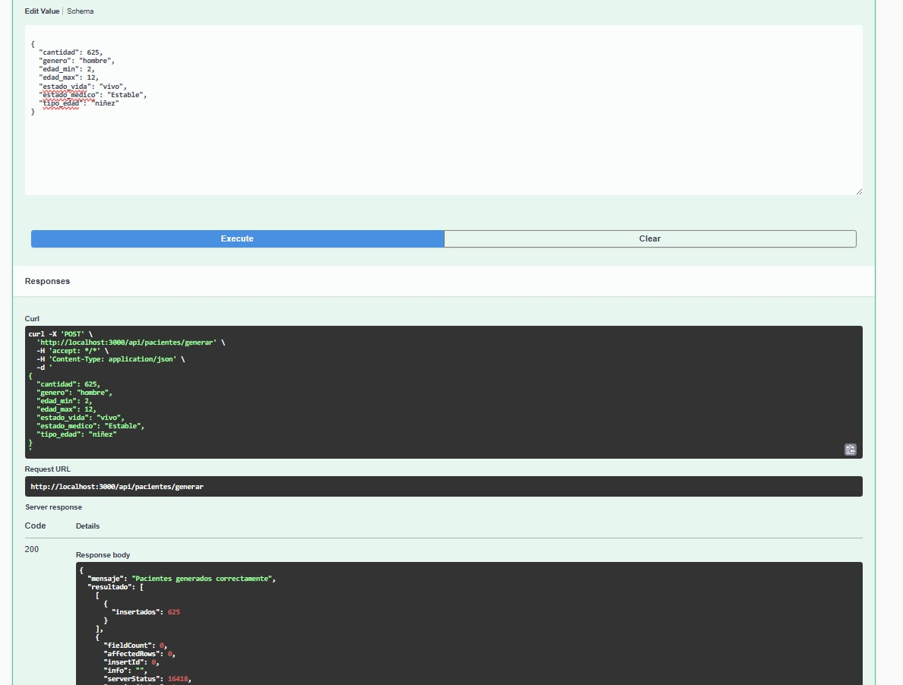</p>

**Respuesta retornada por la API:**
```json
{
  "success": true,
  "message": "Procedimiento ejecutado exitosamente. 625 paciente(s) procesado(s)",
  "parametros": {
    "cantidad": 625,
    "genero": "H",
    "edad_minima": null,
    "edad_maxima": null,
    "estatus_vida": null,
    "estatus_medico": "Pediatrico",
    "etapa_vida": null
  },
  "resultado": []
}
```

**Resultados:**
Se registraron exitosamente 625 pacientes masculinos con estatus médico pediátrico, confirmando que la combinación de género y estatus médico es gestionada correctamente por la API.

> ⚠️ **Imagen pendiente:** Agrega `resultadospacientes625.png` a la carpeta `img/` para completar la evidencia de esta prueba.

---

## 🧪 Prueba 8 - Registrar 111 Pacientes en Coma

**Descripción:**
Se valida que el procedimiento almacenado acepte y procese correctamente el estatus de vida crítico `"Coma"` al registrar 111 pacientes.

> **Endpoint:** `POST /api/poblar-pacientes`

```json
{
  "cantidad": 111,
  "estatus_vida": "Coma"
}
```

**Evidencia de la solicitud:**

<p align="center">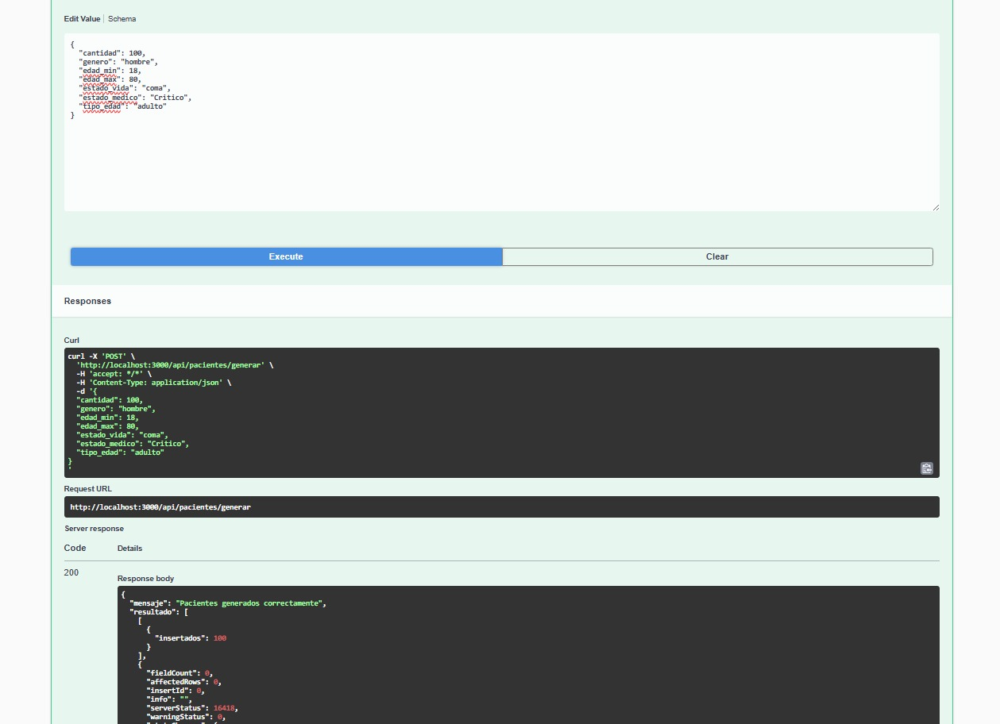</p>

**Respuesta retornada por la API:**
```json
{
  "success": true,
  "message": "Procedimiento ejecutado exitosamente. 111 paciente(s) procesado(s)",
  "parametros": {
    "cantidad": 111,
    "genero": null,
    "edad_minima": null,
    "edad_maxima": null,
    "estatus_vida": "Coma",
    "estatus_medico": null,
    "etapa_vida": null
  },
  "resultado": []
}
```

**Resultados:**
Se registraron exitosamente 111 pacientes con estatus de vida `Coma`, validando que el procedimiento almacenado acepta y procesa correctamente este estatus crítico.

<p align="center"></p>

---

## 🧪 Prueba 9 - Registrar 23k Pacientes No Binarios

**Descripción:**
Se verifica que el sistema soporte el valor de género no binario (`"N/B"`) a gran escala, registrando 23,000 pacientes con esta clasificación.

> **Endpoint:** `POST /api/poblar-pacientes`

```json
{
  "cantidad": 23000,
  "genero": "N/B"
}
```

**Evidencia de la solicitud:**

<p align="center">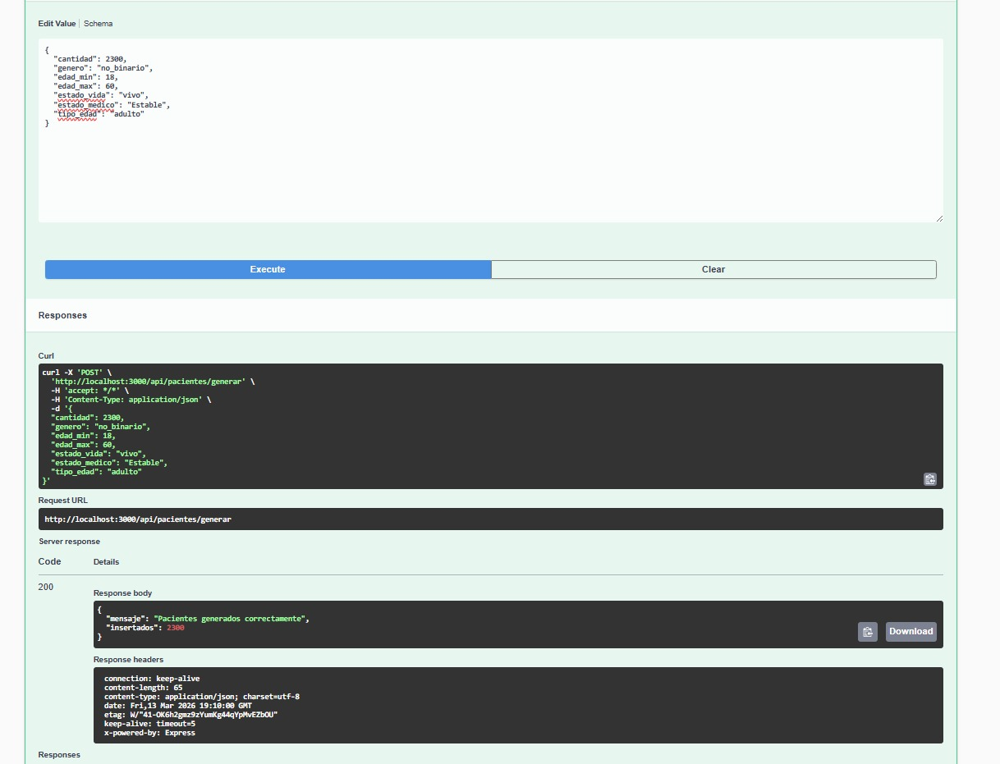</p>

**Respuesta retornada por la API:**
```json
{
  "success": true,
  "message": "Procedimiento ejecutado exitosamente. 23000 paciente(s) procesado(s)",
  "parametros": {
    "cantidad": 23000,
    "genero": "N/B",
    "edad_minima": null,
    "edad_maxima": null,
    "estatus_vida": null,
    "estatus_medico": null,
    "etapa_vida": null
  },
  "resultado": []
}
```

**Resultados:**
Se registraron exitosamente 23,000 pacientes de género no binario (`N/B`), verificando que el sistema soporta correctamente este valor de género a gran escala.

<p align="center"></p>

---

## 🧪 Prueba 10 - Registrar 3416 Pacientes con COVID (Vivos y Fallecidos)

**Descripción:**
Se comprueba que al omitir el campo `estatus_vida`, el procedimiento almacenado asigne uno de forma aleatoria entre todos los estatus disponibles, incluyendo tanto pacientes vivos como finados. Se registran 3,416 pacientes con diagnóstico de COVID.

> **Endpoint:** `POST /api/poblar-pacientes`

```json
{
  "cantidad": 3416,
  "estatus_medico": "COVID"
}
```

**Evidencia de la solicitud:**

<p align="center">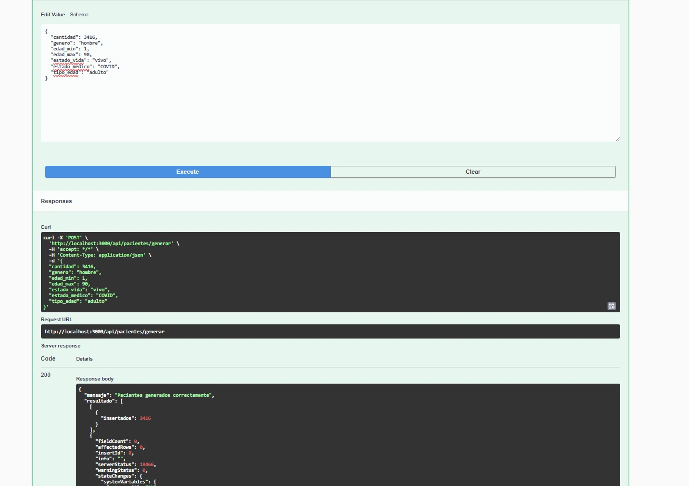</p>

**Respuesta retornada por la API:**
```json
{
  "success": true,
  "message": "Procedimiento ejecutado exitosamente. 3416 paciente(s) procesado(s)",
  "parametros": {
    "cantidad": 3416,
    "genero": null,
    "edad_minima": null,
    "edad_maxima": null,
    "estatus_vida": null,
    "estatus_medico": "COVID",
    "etapa_vida": null
  },
  "resultado": []
}
```

**Resultados:**
Se registraron exitosamente 3,416 pacientes con diagnóstico de COVID, con estatus de vida asignado de forma aleatoria por el procedimiento almacenado, incluyendo tanto pacientes vivos como fallecidos.

<p align="center"></p>

---

## 📊 Resultados Generales

Resumen visual consolidado del comportamiento de la API tras la ejecución de todas las pruebas, agrupado por categorías de análisis.

---

### 1. Resultado general de pruebas en estatus médicos

Concentrado del total de pacientes registrados agrupados por su estatus médico (Diabético, Pediátrico, COVID, entre otros), permitiendo validar la distribución correcta aplicada por el procedimiento almacenado en cada caso.

<p align="center"></p>

---

### 2. Resultado de prueba general de estatus de vida por tipo de edad

Distribución de los pacientes registrados clasificados simultáneamente por su estatus de vida (Vivo, Finado, Coma, Inválido) y por su etapa o rango de edad (Neonato, Recién nacido, Pediátrico, Adulto, etc.), verificando la correcta combinación de ambos parámetros.

<p align="center"></p>

---

### 3. Resultado general de estatus de vida

Vista global del total de pacientes registrados durante todas las pruebas, agrupados únicamente por su estatus de vida, confirmando que los valores asignados — tanto explícitos como aleatorios — se distribuyen de forma coherente y esperada.

<p align="center"></p>

---

<div align="center">

**Hospital MR** · API de Gestión de Pacientes · 10 pruebas completadas ✅

</div>
